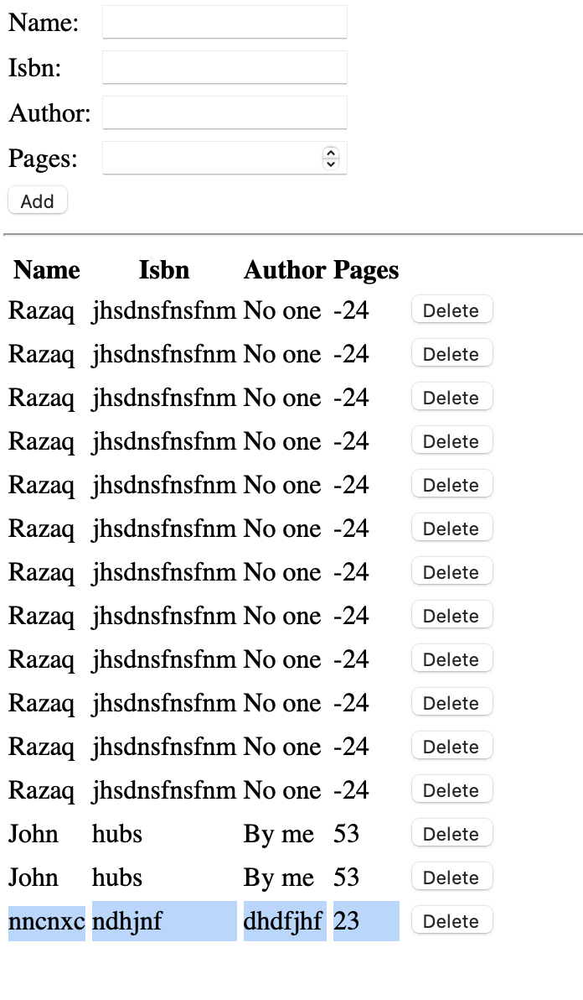

## Project 4 Documentation

'sudo apt update'

'sudo apt upgrade'

'sudo apt -y install curl dirmngr apt-transport-https lsb-release ca-certificates

curl -sL https://deb.nodesource.com/setup_12.x | sudo -E bash -'

'sudo apt install -y nodejs'

'sudo apt-key adv --keyserver hkp://keyserver.ubuntu.com:80 --recv 0C49F3730359A14518585931BC711F9BA15703C6

echo "deb [ arch=amd64 ] https://repo.mongodb.org/apt/ubuntu trusty/mongodb-org/3.4 multiverse" | sudo tee /etc/apt/sources.list.d/mongodb-org-3.4.list'

'sudo apt install -y mongodb'

'sudo service mongodb start'

'sudo systemctl status mongodb'

'sudo apt install -y npm'

'sudo npm install body-parser'

'mkdir Books && cd Books'

'npm init'

'vi server.js'

'sudo npm install express mongoose'

'mkdir apps && cd apps'

'vi routes.js'

'mkdir models && cd models'

'vi book.js'

'mkdir public && cd public'

'vi script.js'

'vi index.html'

'node server.js'

